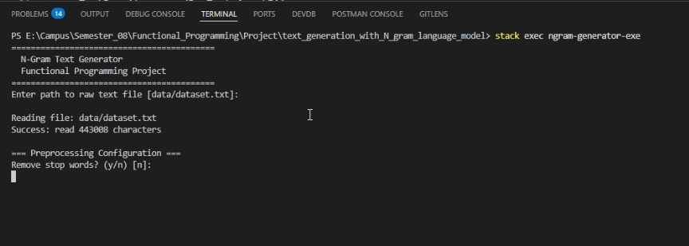
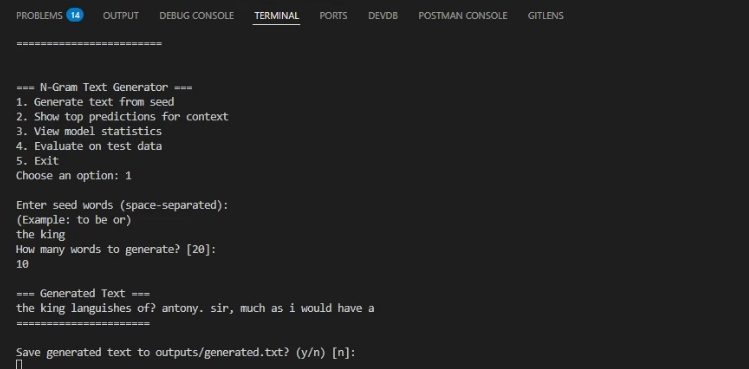
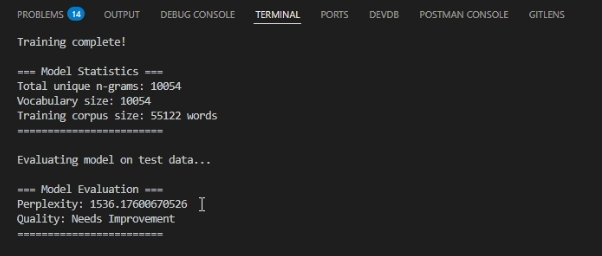
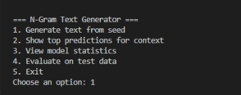

# N-Gram Text Generator

## Mini Project - Functional Programming - Group 11

**Title:** Text Generation with N-gram Language Model

---

## Team Members: Group 11

| Name | Registration Number |
|------|---------------------|
| Senanayaka S.M.S.T.S | EG/2020/4185 |
| Samasundara S.M.R.D.S | EG/2020/4184 |
| Dissanayaka R.P.L.M. | EG/2020/3909 |
| Dissanayaka D.M.C.L. | EG/2020/3903 |

---

## Project Links

**Project Code Link:**  
https://github.com/Sahaswari/text_generation_with_N_gram_language_model.git

**Project Video Link:**  
https://youtu.be/px1O29Y3twk

---

## Table of Contents

1. [Setup Guide](#setup-guide)
2. [Introduction](#1-introduction)
3. [Functional Design](#2-functional-design)
4. [Functional Programming Concepts Implementation](#3-functional-programming-concepts-implementation)
5. [Expected Outputs and Validation](#4-expected-outputs-and-validation)
6. [Conclusion](#5-conclusion)

---

## Setup Guide

### Prerequisites

- **Stack** (Haskell build tool) - Recommended
- OR **GHC** (Glasgow Haskell Compiler) version 8.10 or higher
- Text corpus file (provided in `data/` folder)

### Installation Steps

#### Option 1: Using Stack (Recommended)

1. **Clone the repository**
   ```bash
   git clone https://github.com/Sahaswari/text_generation_with_N_gram_language_model.git
   cd text_generation_with_N_gram_language_model
   ```

2. **Build the project**
   ```bash
   stack build
   ```
   Note: First build will download GHC and dependencies automatically.

3. **Run the application**
   ```bash
   stack exec ngram-generator-exe
   ```

#### Option 2: Using GHC Directly

1. **Clone the repository**
   ```bash
   git clone https://github.com/Sahaswari/text_generation_with_N_gram_language_model.git
   cd text_generation_with_N_gram_language_model
   ```

2. **Compile the project**
   ```bash
   ghc -o ngram-generator src/Main.hs src/DataTypes.hs src/Utils.hs src/Processing.hs src/IOHandler.hs src/DataPreprocessing.hs src/ReportGenerator.hs
   ```

3. **Run the executable**
   ```bash
   ./ngram-generator
   ```
   On Windows:
   ```bash
   ngram-generator.exe
   ```

#### Option 3: Using GHCi (Interactive)

```bash
ghci src/Main.hs
> main
```

### Project Structure

```
text_generation_with_N_gram_language_model/
├── src/
│   ├── Main.hs              - Entry point and user interface
│   ├── DataTypes.hs         - Type definitions
│   ├── DataPreprocessing.hs - Text cleaning and tokenization
│   ├── Processing.hs        - N-gram model building and generation
│   ├── IOHandler.hs         - File I/O operations
│   ├── ReportGenerator.hs   - Report generation
│   └── Utils.hs             - Helper functions
├── data/
│   └── dataset.txt          - Training corpus
├── outputs/
│   └── reports/             - Generated reports
├── package.yaml             - Project configuration
├── stack.yaml               - Stack configuration
└── README.md
```

---

## 1. Introduction

The project is to develop a text generation system using N-gram language models that can predict the next word based on previous words using the Haskell based implementation environment. It demonstrates pure functional principles while solving a real world NLP problem.

### Industry Applications

**Natural Language Processing (NLP) Applications:**
- Autocomplete features in search engines and text editors
- Predictive text input on mobile keyboards
- Chatbot response generation
- Content suggestion systems

**Business Value:**
- Improves user experience in text-based applications
- Reduces typing time and effort (productivity enhancement)
- Powers recommendation systems in messaging apps

**Why Statistical Approach Matters:**
- N-gram models provide probabilistic understanding of language patterns
- Computationally efficient compared to deep learning alternatives
- Transparent and explainable predictions
- Suitable for resource-constrained environments

### Screenshots

**Application Startup:**



**Text Generation Output:**



---

## 2. Functional Design

### Main Data Types (ADTs)

#### 1. NGram Type

Represents the sequence of words used as context. Simple alias for clarity and maintainability.

```haskell
type NGram = [String]
```

#### 2. NGramModel Type

Maps N-gram contexts to possible next words. Associate list structure for functional manipulation.

```haskell
type NGramModel = Map.Map NGram (Map.Map Token Int)
```

#### 3. GenerationSession Record

Encapsulates all information about a generation run. Used for report generation and tracking.

```haskell
data GenerationSession = GenerationSession
  { sessionTimestamp    :: UTCTime
  , inputFilePath       :: FilePath
  , ngramSize          :: Int
  , seedWords          :: [String]
  , requestedWords     :: Int
  , generatedText      :: [String]
  }
```

### Key Function Modules

| Module | Responsibility |
|--------|---------------|
| Text Processing Module | Cleaning, tokenization, preprocessing |
| Model Building Module | N-gram extraction and frequency counting |
| Text Generation Module | Probabilistic word prediction |
| Helper Functions (Pure) | Utility operations without side effects |

### Screenshots

**Model Training Process:**




<!-- Add screenshot here:  -->

**Interactive Menu:**



<!-- Add screenshot here:  -->

---

## 3. Functional Programming Concepts Implementation

### Pure Functions

**Benefits:**
- Easy to test individual functions in isolation
- Predictable behavior makes debugging simpler
- Functions can be reused and composed safely

**Implementation in the code:**

```haskell
cleanWord :: String -> String                    -- Deterministic text cleaning
generateNGrams :: Int -> [String] -> [NGram]     -- Pure transformation of word lists
averageLength :: [String] -> Double              -- Statistical calculation without side effects
removeDuplicates :: Eq a => [a] -> [a]           -- Pure list processing
wrapText :: Int -> String -> String              -- Pure text formatting
formatDouble :: Double -> String                 -- Pure number formatting
getModelType :: Int -> String                    -- Pure mapping from number to string
```

---

### Recursion

**Benefits:**
- Natural representation of iterative processes
- Eliminates need for mutable loop counters
- Aligns with mathematical induction principles
- Easier to reason about correctness

**Implementation in the project code:**

- `generateText` function uses recursion to build text word by word
- `removeDuplicates` uses recursive pattern matching:
  - Base case: empty list returns empty list
  - Recursive case: keeps first element, filters it from rest, recurses
- `wrapText` recursively processes words for line wrapping:
  - Base case: no more words to process
  - Recursive case: adds words to current line until width exceeded
  - Builds output line by line through recursion

```haskell
removeDuplicates :: Eq a => [a] -> [a]
removeDuplicates [] = []
removeDuplicates (x:xs) = x : removeDuplicates (filter (/= x) xs)
```

---

### Algebraic Data Types (ADTs)

**Benefits:**
- Type safety prevents invalid data combinations
- Pattern matching enables exhaustive case handling
- Cannot create invalid session states

**Implementation in the project code:**

`GenerationSession` record type - Complete ADT with six named fields:

| Field | Type | Description |
|-------|------|-------------|
| sessionTimestamp | UTCTime | When generation occurred |
| inputFilePath | FilePath | Source data file |
| ngramSize | Int | Model order (2, 3, 4, etc.) |
| seedWords | [String] | Starting words |
| requestedWords | Int | Desired output length |
| generatedText | [String] | Actual generated output |

- Derives Show for easy display
- Type aliases (NGram, NGramModel) for clarity
- Built-in ADTs used: Maybe, Either, Lists, UTCTime

---

### Higher-Order Functions

**Benefits:**
- Code Density and Maintainability
- Memory Efficiency and Performance
- Parallelization and Concurrency

**Implementation in the project code:**

```haskell
-- map: Apply functions to all elements
map cleanWord words
map length words
map formatTimestamp times

-- filter: Remove elements based on predicate
filter (not . null) words          -- Remove empty strings
filter (/= x) xs                   -- Remove specific element in removeDuplicates

-- foldr/foldl: Accumulate results
sum $ map length words             -- Sum of all word lengths

-- Function composition with (.):
(not . null)                       -- Compose negation with null check
```

---

### Immutability

All data structures in the project are immutable. New values are created instead of modifying existing ones.

```haskell
type NGramModel = Map.Map NGram (Map.Map Token Int)
```

---

### Lazy Evaluation

Lists are processed on demand, enabling efficient handling of large datasets without loading everything into memory.

### Screenshots

**Code Structure - Pure Functions:**

[Image: Pure function examples in code]

<!-- Add screenshot here:  -->

**Code Structure - Higher-Order Functions:**

[Image: Higher-order function usage]

<!-- Add screenshot here:  -->

---

## 4. Expected Outputs and Validation

### Sample Input

```
INPUT PARAMETERS
- Data File: data/dataset.txt
- N-gram Size: 3 (Trigram)
- Seed Words: to be
- Requested Words: 20
```

### Sample Output

```
OUTPUT
Generated Text:
to be entangled with those mouth-made vows which break themselves in her that the men might go on wheels

Statistics:
- Total Words Generated: 20
- Unique Words: 18
- Average Word Length: 4.5 characters
```

### Screenshots

**Generation Results:**

[Image: Sample generation output]

<!-- Add screenshot here:  -->

**Model Statistics:**

[Image: Model statistics display]

<!-- Add screenshot here:  -->

---

## 5. Conclusion

This N-gram text generator demonstrates how functional programming principles create robust, maintainable, and scalable software. The use of pure functions, immutability, and strong typing provides reliability guarantees that are difficult to achieve in imperative languages, while the functional approach naturally supports concurrent execution without additional complexity.

### Key Achievements

- Implemented working N-gram language model in pure Haskell
- Demonstrated core functional programming concepts
- Created interactive text generation system
- Built modular, testable codebase with clear separation of concerns

### Future Extensions

- Add smoothing techniques (Laplace, Good-Turing)
- Implement beam search for better generation
- Support multiple languages
- Build web interface

---

## Usage Examples

### Bigram Model (1-word context)

```
N-gram size: 2
Seed: the
Words: 15
```

### Trigram Model (2-word context) - Recommended

```
N-gram size: 3
Seed: to be
Words: 20
```

### 4-gram Model (3-word context)

```
N-gram size: 4
Seed: to be or
Words: 15
```

---

